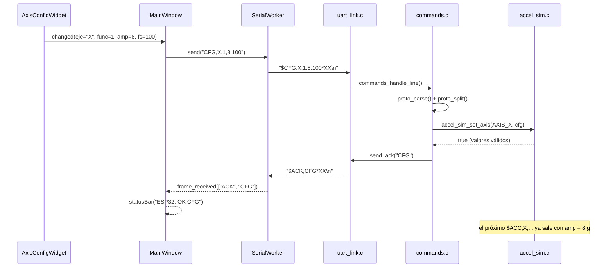
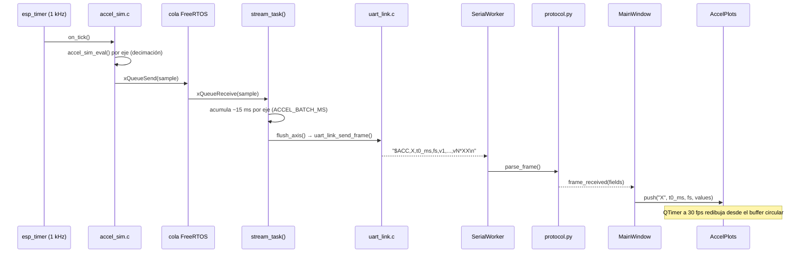

# Tarea 1: Conexión Serial ESP32 ↔ PC

**CC5328-1 Sistemas Embebidos y Sensores · Universidad de Chile · Semestre 2026-2**

Sistema de adquisición y control de datos en tiempo real: un ESP32 emula un acelerómetro
tri-axial y un sensor de temperatura/humedad, y los transmite por UART (USB-serial) a una
aplicación de escritorio en Python/PyQt que grafica las señales y reconfigura el
microcontrolador en vivo.

**Integrantes:** 
Joaquín Acosta, 
Matías Saavedra

> Enunciado completo: [`docs/Tarea1_CC5328_v2.pdf`](docs/Tarea1_CC5328_v2.pdf).
> Estado del trabajo y decisiones pendientes: [`TODO.md`](TODO.md).

## Estructura del repositorio

```
esp32_firmware/          Firmware ESP-IDF (C)
  CMakeLists.txt         Proyecto idf.py
  sdkconfig.defaults     Configuración base (target esp32, log level, baud del monitor)
  main/
    main.c               app_main: inicializa módulos y arranca la simulación
    app_config.h         Constantes y valores por defecto del enunciado
    protocol.[ch]        Paquete "$payload*XX" + checksum XOR (espejo de gui_python/protocol.py)
    uart_link.[ch]       Driver UART0, envío de paquetes, tarea de recepción por líneas
    commands.[ch]        Interpretación de comandos de la GUI (CFG / ENV / INIT)
    accel_sim.[ch]       Acelerómetro sintético: 3 ejes, función/amplitud/fs independientes
    env_sim.[ch]         Temperatura y humedad aleatorias cada 30 s o 60 s
gui_python/              Aplicación PyQt5
  main.py                Punto de entrada
  main_window.py         Ventana principal: conecta paneles, gráficos y puerto serie
  serial_worker.py       Hilo de lectura/escritura serial (pyserial + QThread)
  protocol.py            Paquetes y checksum (espejo de protocol.c)
  widgets/               Un archivo por panel: conexión, configuración, gráficos, ambiental
  tests/                 Pruebas unitarias del protocolo (pytest)
  requirements.txt
docs/                    Enunciado y capturas de pantalla
Doxyfile                 Configuración de Doxygen (documentación del código, ver más abajo)
```

## Requisitos

| Componente | Versión |
|---|---|
| Tarjeta | ESP32 (target `esp32`) |
| Framework firmware | ESP-IDF **v6.1** (probado) |
| Python | 3.8+ |
| Librerías GUI | PyQt5, pyserial, pyqtgraph, numpy (ver `gui_python/requirements.txt`) |

## Compilación y carga del firmware

```bash
# 1. Activar ESP-IDF (instalación con el ESP-IDF Installation Manager)
. ~/.espressif/tools/activate_idf_v6.1.sh        # o:  . $IDF_PATH/export.sh

# 2. Compilar
cd esp32_firmware
idf.py build

# 3. Cargar y abrir el monitor serial (Ctrl+] para salir)
idf.py -p /dev/ttyUSB0 flash monitor
```

Notas:

- En Linux el usuario debe pertenecer al grupo `dialout` para abrir `/dev/ttyUSB0`.
- El monitor de `idf.py` y la GUI **no pueden usar el puerto al mismo tiempo**: cerrar el
  monitor antes de conectar desde la aplicación.
- Los cambios permanentes de configuración van en `sdkconfig.defaults` (`sdkconfig` está
  ignorado por git). Para regenerarlo: `rm sdkconfig && idf.py reconfigure`.
- El enlace funciona a **921600 baud** (`LINK_BAUD` en `main/app_config.h`); el monitor usa
  la misma velocidad vía `sdkconfig.defaults`. Tras cambiar `sdkconfig.defaults` (p. ej. al
  hacer `git pull`) hay que regenerar: `rm sdkconfig && idf.py reconfigure`.

## Ejecución de la aplicación

```bash
python3 -m venv .venv && source .venv/bin/activate      # Windows: .venv\Scripts\activate
pip install -r gui_python/requirements.txt
python gui_python/main.py
```

Pruebas unitarias del protocolo: `pytest gui_python/tests`

Documentación del código: todo el firmware (C) y la GUI (Python) llevan comentarios
Doxygen; `doxygen` desde la raíz del repositorio genera `docs/doxygen/html/index.html`
(directorio ignorado por git).

## Uso

1. Conectar el ESP32 por USB, elegir el puerto y el baud rate. La lista muestra primero
   los adaptadores USB-serial con su descripción (`/dev/ttyUSB0: Silicon Labs CP2102…`,
   `COM3: …`) y después los puertos heredados de la placa madre (`/dev/ttyS0`, `COM1`),
   que se abren sin error pero no llevan a ningún lado; el primero de la lista queda
   preseleccionado. El selector de baud rate indica **la velocidad a la que se quiere que
   funcione el enlace**, no la de apertura: el puerto se abre siempre a 921600 (la placa
   arranca a `LINK_BAUD`) y, si se eligió otra, la GUI la renegocia en cuanto la conexión
   está lista. Pulsar **Conectar**. La GUI abre el puerto, **reinicia la tarjeta**
   (pulso en EN vía RTS, con DTR inactivo para que arranque el firmware) y espera ~1 s a
   que termine de arrancar antes de mostrar "Conectado" y habilitar los controles; las
   líneas del bootloader ROM (a 115200) y los logs de arranque se descartan
   automáticamente (el contador de paquetes rechazados sube unas decenas).
2. Pulsar **Inicializar ESP32**: el firmware vuelve a los valores por defecto del enunciado
   (armónica simple, 4 g, 100 Hz, ambiental cada 30 s) y responde con `ACK`.
3. Cambiar función / amplitud / frecuencia de muestreo de cada eje: el cambio se envía de
   inmediato y se refleja en el gráfico correspondiente.
4. Elegir el periodo del sensor ambiental (30 s / 60 s).
5. Cambiar el baud rate **estando conectado** renegocia el enlace: la GUI envía `$BAUD`, el
   ESP32 responde a la velocidad antigua y luego conmuta, la GUI conmuta al recibir esa
   respuesta y envía `$INIT` para confirmar (ver *Decisiones de diseño*). Si algo falla,
   ambos extremos vuelven solos a 921600 en unos segundos y la GUI lo avisa. Al
   **desconectar**, el selector vuelve a 921600: la placa arranca siempre a `LINK_BAUD`, así
   que abrir el puerto a la velocidad renegociada daría una conexión muda.

La barra de estado muestra las respuestas del ESP32 y un contador de paquetes válidos y
rechazados (checksum incorrecto o líneas que no son paquetes), útil para verificar la
estabilidad del enlace.

## Protocolo de comunicación

Protocolo de texto, un paquete por línea, implementado de forma idéntica en `protocol.c` y
`protocol.py`:

```
$<payload>*<XX>\n
```

- `payload`: campos separados por coma; el primero es el tipo de mensaje.
- `XX`: checksum = XOR de todos los bytes del payload, en dos dígitos hexadecimales.
  Ejemplo: `INIT` → `'I'^'N'^'I'^'T'` = `0x1A` → `$INIT*1A`.
- Cualquier línea que no cumpla el formato o cuyo checksum no coincida se descarta y se
  cuenta (mensajes de arranque, `ESP_LOG`, bytes corruptos).

### PC → ESP32 (comandos)

| Comando | Paquete | Respuesta |
|---|---|---|
| Configurar eje | `$CFG,<eje>,<func>,<amp>,<fs>*XX`: eje `X`/`Y`/`Z`, func `1..3`, amp `4`/`8`/`16`, fs `50`/`100`/`200`/`500`/`1000` | `$ACK,CFG*XX` o `$ERR,BADARG*XX` |
| Periodo ambiental | `$ENV,<segundos>*XX`: `30` o `60` | `$ACK,ENV*XX` o `$ERR,BADARG*XX` |
| Inicializar | `$INIT*XX`: valores por defecto y (re)inicio del streaming | `$ACK,INIT,<versión>*XX` |
| Cambiar velocidad | `$BAUD,<baud>*XX`: `115200`/`230400`/`460800`/`921600` | `$ACK,BAUD,<baud>*XX` (a la velocidad **anterior**) o `$ERR,BADARG*XX` |

Errores posibles: `BADFRAME` (formato/checksum), `EMPTY`, `UNKNOWN` (tipo desconocido),
`BADARG` (valor fuera de las opciones permitidas), `NOTIMPL` (comando aún no implementado).

`$BAUD` es el único comando cuya respuesta viaja a una velocidad distinta de la que tendrá
el enlace inmediatamente después; los detalles y la reversión automática están en
*Decisiones de diseño*.

### ESP32 → PC (datos)

| Mensaje | Paquete | Notas |
|---|---|---|
| Acelerómetro | `$ACC,<eje>,<t0_ms>,<fs>,<v1>,<v2>,…,<vN>*XX` | N muestras consecutivas de un eje (en g), separadas `1/fs` s; `t0_ms` es el instante de `v1` desde el arranque |
| Ambiental | `$ENV,<temp_c>,<hum_pct>*XX` | ej. `$ENV,23.4,31*XX` |

Las muestras se agrupan en paquetes de ~10–20 ms por eje para que 3 ejes a 1000 Hz quepan en
el enlace (ver *Decisiones de diseño*).

## Decisiones de diseño


- **Ancho de banda / baud rate.** Peor caso: 3 ejes × 1000 Hz = 3000 muestras/s. Los
  paquetes `$ACC` se agrupan por eje cada `ACCEL_BATCH_MS = 15` ms (`stream_task()` en
  `accel_sim.c`) para amortizar el encabezado y el checksum, pero cada valor sigue ocupando
  ~8 bytes (`-16.000,`). Con el formato implementado el enlace necesita:

  | Configuración | Necesario | Uso @115200 | Uso @921600 |
  |---|---|---|---|
  | 3 × 100 Hz (por defecto) | 87 kbaud | 76 % | 9 % |
  | 3 × 500 Hz | 165 kbaud | **143 %** | 18 % |
  | 1000 + 100 + 100 Hz | 153 kbaud | **133 %** | 17 % |
  | 3 × 1000 Hz | 284 kbaud | **247 %** | 31 % |

  A 115200 (el ejemplo del enunciado) cualquier eje a 1000 Hz o los tres a 500 Hz saturan
  el enlace: `uart_write_bytes()` bloquea la tarea de streaming, la cola se llena y
  `on_tick()` descarta muestras, de modo que los paquetes contienen muestras no consecutivas
  etiquetadas como consecutivas (forma de onda distorsionada). Por eso el enlace se fija en
  **921600 baud** en ambos extremos (`LINK_BAUD` en el firmware, `DEFAULT_BAUD` en la GUI;
  el puente USB-serial CP2102 de la tarjeta lo soporta); el selector de la GUI permite
  bajarla en caliente (ver *Cambio de velocidad en caliente*), no subirla más allá. Si aun así se descartan
  muestras, el firmware lo avisa en el monitor (`samples dropped so far: link saturated`) y
  la GUI lo muestra como una tasa medida menor que la configurada.
- **Cambio de velocidad en caliente.** El selector de baud de la GUI no podía cambiar la
  velocidad del firmware (fijada en compilación por `LINK_BAUD`): elegir otro valor solo
  desincronizaba los extremos. Ahora el selector significa una sola cosa: la velocidad a la
  que debe funcionar el enlace, y la GUI envía `$BAUD,<baud>` para conseguirla.
  Los dos extremos no pueden conmutar en el mismo instante, así que conmutan **en orden**:
  el firmware detiene el streaming, responde `$ACK,BAUD,<baud>` *a la velocidad antigua*,
  espera a que el buffer de transmisión se vacíe (`uart_wait_tx_done()`, si no la respuesta
  saldría partida en dos velocidades) y recién entonces llama a `uart_set_baudrate()`; la GUI
  conmuta al recibir esa respuesta y manda `$INIT`, que confirma la velocidad y reanuda el
  streaming. Como `uart_vfs_dev_use_driver()` enruta `ESP_LOG` por el mismo driver, los logs
  siguen la nueva velocidad automáticamente.

  La velocidad nueva es **provisional**: el firmware arma un temporizador de
  `LINK_BAUD_REVERT_MS` = 5 s y vuelve a `LINK_BAUD` si no recibe ningún paquete válido
  (`uart_link_confirm_baud()`), y la GUI hace lo mismo a los 8 s. Sin esa reversión, elegir
  una velocidad que el puente USB-serial no pueda sostener dejaría la placa muda hasta
  apretar EN.

  El arranque siempre ocurre a `LINK_BAUD` (el bootloader ROM ni siquiera es configurable) y
  la GUI reinicia la placa al conectar, así que **el puerto se abre siempre a `DEFAULT_BAUD`
  y la renegociación es posterior**, aunque el selector muestre otra velocidad: elegir 230400
  estando desconectado y pulsar **Conectar** abre a 921600, renegocia a 230400 y recién
  entonces habilita los controles. La primera versión de esta función usaba el selector como
  velocidad de apertura, y elegir otra antes de conectar daba una conexión que decía
  "Conectado" y no recibía nada (la placa, recién reiniciada, hablaba a 921600); por eso el
  selector ya no decide cómo se abre el puerto. Mientras la renegociación está en curso, el
  selector y **Inicializar ESP32** quedan deshabilitados, porque un `$INIT` escrito a la
  velocidad vieja caería en medio del cambio.
- **Muestreo por eje.** Un tick maestro de 1 kHz (`esp_timer`, `on_tick()` en
  `accel_sim.c`) del que cada eje toma una muestra cada `1000/fs` ticks (decimación,
  divisores 1/2/5/10/20); el tiempo global `t = tick/1000` mantiene la fase continua al
  cambiar `fs` en caliente.
- **Frecuencias de las señales** (`f`, `f1`, `f2`, no fijadas por el enunciado): se usan
  los valores por defecto de `app_config.h` (`ACCEL_F_HZ = 2 Hz`, `ACCEL_F1_HZ = 0.5 Hz`,
  `ACCEL_F2_HZ = 5 Hz`), elegidos para que la componente más alta (2f en a₃) quede bien
  por debajo de fs/2 incluso a la fs mínima (50 Hz → 25 muestras por ciclo).
- **Fórmula a₃(t).** Se implementó **literal** tal como aparece en el enunciado:
  `a3(t) = (2A/2) · [sin(2πft) + cos(4πft)]` (equivalente a `A · [...]`, con pico teórico
  `2A`). Se optó por no desviarse de la definición del enunciado en vez de asumir una
  errata; ver `accel_sim_eval()` en `accel_sim.c`.
- **"Inicializar ESP32".** `$INIT` restaura los valores por defecto del enunciado, **inicia
  el streaming** (acelerómetro + ambiental) y responde `$ACK,INIT,<versión>`. El streaming
  **no** arranca solo al encender la tarjeta, sino solo tras recibir `$INIT` (`main.c` solo
  inicializa colas/tareas en el arranque; `handle_init()` en `commands.c` es quien llama a
  `accel_sim_start()`/`env_sim_start()`). La GUI también espera este `$ACK,INIT` antes de
  reiniciar su propio panel a los valores por defecto, en vez de asumir éxito al enviar el
  comando (`main_window.py`).
- **Reinicio explícito al conectar.** Abrir el puerto ya conmuta DTR/RTS y, a través del
  circuito de auto-reset de la tarjeta, suele reiniciar el ESP32; pero el orden y la
  duración con que el sistema operativo conmuta esas líneas no están controlados y en Linux
  con el puente CP2102 dejaban al chip **colgado** (mudo y sin responder a `$INIT`) en la
  mayoría de las conexiones (medido: 1–4 conexiones útiles de cada 10, igual con la versión
  a 115200). Por eso `SerialWorker` aplica tras abrir el puerto la misma secuencia que
  `esptool` para un *hard reset*: DTR inactivo (IO0 alto, arranque normal y no el modo de
  descarga), RTS activo 100 ms (EN bajo), RTS inactivo, y solo emite `connected` tras
  `BOOT_WAIT_S = 1 s`, con lo que **Inicializar ESP32** no puede enviarse a un chip que aún
  arranca (10 de 10 conexiones útiles). Como el streaming solo empieza con `$INIT`, el
  reinicio no pierde nada.
- **Consola compartida.** UART0 transporta datos y logs; los logs no empiezan con `$` y se
  descartan en la GUI y en el parser (`proto_parse`). Ver `TODO.md` ítem **FW6** para la
  política de logs pendiente de definir antes de la demo.
- **Estado del streaming vs. estado de la conexión.** **Desconectar** solo cierra el puerto
  serial local: no envía ningún comando al ESP32. Si el streaming ya estaba activo (se pulsó
  **Inicializar ESP32** en algún momento), el firmware sigue transmitiendo aunque no haya
  nadie escuchando. Por eso, al volver a **Conectar** con el mismo baud rate, los gráficos
  pueden empezar a recibir datos de inmediato, sin necesidad de pulsar **Inicializar ESP32**
  de nuevo: es el comportamiento esperado, no un error. La única forma de detener el
  streaming del firmware es un cambio de baud rate (`$BAUD`, que llama a `accel_sim_stop()` /
  `env_sim_stop()` antes de conmutar) o reiniciar la placa (botón **EN**, o al reconectar,
  que ya hace un *hard reset*; ver *Reinicio explícito al conectar*). No existe un comando
  `$STOP` explícito, y no hizo falta: una vez que `$INIT` quedó definido como el único punto
  de entrada al streaming, `$BAUD` quedó como el único punto que necesitaba detenerlo primero.
- **Errores de comando.** `BADARG` se usa tanto para valores fuera de rango como para
  cantidad de campos incorrecta o eje no reconocido (`X`/`Y`/`Z`); `BADFRAME` queda
  reservado a fallos de framing/checksum detectados por `proto_parse`, no por los
  manejadores de comando.

## Correspondencia GUI ↔ Firmware (widgets y funciones)

Cada widget de la GUI tiene una contraparte concreta en el firmware con la que se comunica
exclusivamente a través de los paquetes `$...*XX` (nunca hay llamadas directas ni estado
compartido). Esta sección documenta esa correspondencia widget por widget.

| Widget | Definición GUI | Definición firmware |
|---|---|---|
| "Conexión serial" | `ConnectionPanel._on_connect_clicked()`: abre el puerto a `DEFAULT_BAUD` + hard reset DTR/RTS | `uart_link_init()` (`uart_link.c`), arranca el driver UART0 al boot |
| Selector de baud rate | `ConnectionPanel._on_baud_changed()` (distinta de la de `MainWindow`) → señal `baud_change_requested` → `MainWindow._request_baud_change()`: envía `$BAUD,<baud>*XX` y arma `_baud_timer` (`BAUD_NEGOTIATION_MS`) | `handle_baud()` (`commands.c`): `accel_sim_stop()` + `env_sim_stop()`, responde `$ACK,BAUD,<baud>*XX` a la velocidad **anterior** y recién entonces llama a `uart_link_set_baud()` (`uart_link.c`) |
| Selector de baud rate | `MainWindow._on_frame()`, rama `ACK,BAUD`: `self.worker.request_baud(int(fields[2]))` conmuta el puerto local a la nueva velocidad | `uart_link_set_baud()` arma además un temporizador de reversión (`on_revert()`), cancelado por `uart_link_confirm_baud()` en el primer frame válido a la nueva velocidad |
| Selector de baud rate | `SerialWorker.baud_changed` (tras aplicar el nuevo baud) → `MainWindow._on_baud_changed()`: envía `$INIT*XX` para confirmar la velocidad y reanudar el streaming | `handle_init()` recibido a la nueva velocidad ya confirma implícitamente el cambio (cualquier paquete válido lo hace) |
| Selector de baud rate | si `_baud_timer` expira antes de una respuesta: `MainWindow._on_baud_timeout()` → `_abort_baud_change()`: `worker.request_baud()` regresa el puerto local a la velocidad anterior | el firmware ya revirtió solo, por su propio `on_revert()`, sin esperar nada de la GUI |
| Conectar / Desconectar | `ConnectionPanel.set_busy()` / `_apply_enabled_state()`: deshabilitado durante el cambio de baud rate | sin contraparte, es solo estado visual local |
| Inicializar ESP32 | `MainWindow._send_init()`: envía `$INIT*XX` | `handle_init()` (`commands.c`): `accel_sim_reset_defaults()`, `env_sim_stop()` + `env_sim_set_period(ENV_DEFAULT_PERIOD_S)`, responde `$ACK,INIT,<versión>` y recién entonces llama a `accel_sim_start()` + `env_sim_start()` |
| Eje X / Eje Y / Eje Z | `AxisConfigWidget._emit_changed()` → `ConfigPanel.axis_changed` → `MainWindow._send_axis_config()`: envía `$CFG,<eje>,<func>,<amp>,<fs>*XX` y de inmediato ajusta `AccelPlots.set_amplitude()` (optimista, antes del `ACK`) | `handle_cfg()` (`commands.c`): `parse_field()` valida el formato numérico, luego `accel_sim_set_axis()` (`accel_sim.c`) valida los rangos permitidos (`accel_sim_valid_func/amp/fs()`, internas) y aplica bajo sección crítica |
| Eje X / Eje Y / Eje Z | `AxisConfigWidget.reset_defaults()`, al recibir `$ACK,INIT` | espejo de `accel_sim_reset_defaults()` (`accel_sim.c`), ejecutado dentro de `handle_init()` |
| Sensor ambiental | `ConfigPanel.env_period_changed` → `MainWindow._send_env_period()`: envía `$ENV,<segundos>*XX` | `handle_env()` (`commands.c`): `parse_field()` valida el formato, luego `env_sim_set_period()` (`env_sim.c`) valida el valor permitido (`env_sim_valid_period()`, interna) y reinicia el temporizador si ya estaba corriendo |
| Eje X / Eje Y / Eje Z (gráfico) | `MainWindow._on_frame()` → `AccelPlots.push(axis, t0_ms, fs_hz, values)` al recibir `$ACC,<eje>,<t0_ms>,<fs>,<v1>,…,<vN>*XX` | `flush_axis()` (`accel_sim.c`), llamada desde `stream_task()`, que consume lo que `on_tick()` decimó de `accel_sim_eval()` |
| Eje X / Eje Y / Eje Z (gráfico) | `AccelPlots.set_amplitude(axis, amp_g)`: ajusta el rango del eje Y | deriva del mismo campo `amp` de `$CFG`, sin paquete propio |
| Eje X / Eje Y / Eje Z (gráfico) | `AccelPlots.clear()`, al reconectar o recibir `$ACK,INIT` | sin contraparte, limpieza puramente local de los buffers circulares |
| Eje X / Eje Y / Eje Z (gráfico) | `AccelPlots._redraw()`, timer Qt a 30 fps | sin contraparte, nunca lo dispara el firmware |
| Variables ambientales | `MainWindow._on_frame()` → `EnvPanel.update_values(temp_c, hum_pct)` al recibir `$ENV,<temp_c>,<hum_pct>*XX` | `on_period()` (`env_sim.c`), timer periódico armado por `env_sim_start()`, que llama a `env_sim_read()` |

### `MainWindow` (`gui_python/main_window.py`): el punto de unión

`MainWindow` no tiene contraparte 1:1 en el firmware porque es la capa de orquestación: no
genera ni consume paquetes por sí misma, solo enruta entre `SerialWorker` (el paquete crudo) y los
widgets (la representación visual). El equivalente firmware de ese rol orquestador es
`commands_handle_line()` en `uart_link.c`/`commands.c`, que hace lo mismo en la otra dirección:
recibe la línea cruda y la reparte al manejador (`handle_cfg`, `handle_env`, `handle_init` o
`handle_baud`) correspondiente.

### Flujo de un comando (ejemplo: `$CFG`)



### Flujo de un dato (ejemplo: `$ACC`)




_(agregar en `docs/screenshots/` y enlazar aquí)_

## Solución de problemas

| Síntoma | Causa / solución |
|---|---|
| `Permission denied: /dev/ttyUSB0` | `sudo usermod -aG dialout $USER` y volver a iniciar sesión |
| `Device or resource busy` | Otro programa (p. ej. `idf.py monitor`) tiene el puerto abierto |
| Contador de paquetes rechazados sube al conectar | Normal: salida del bootloader tras el reinicio que hace la GUI al conectar |
| "Conectado" pero **Inicializar ESP32** no responde y los contadores no se mueven (ni siquiera rechazadas al conectar) | Puerto equivocado: un puerto heredado como `/dev/ttyS0` o `COM1` se abre sin error y no responde nada. Elegir la entrada con la descripción del adaptador USB (CP2102) |
| "Conectado" a `/dev/ttyUSB0`/`COMx`, rechazadas subió al conectar, pero **Inicializar ESP32** no responde (sin `ACK`, sin paquete) | El chip quedó colgado por una conmutación de DTR/RTS fuera de la GUI (p. ej. al cerrar `idf.py monitor`); **Desconectar** y **Conectar** de nuevo lo reinicia. Si persiste, pulsar el botón **EN** de la placa y volver a **Inicializar**; si la GUI avisa "No se pudo reiniciar el ESP32", el adaptador no expone DTR/RTS y hay que usar el botón EN |
| Contador de rechazadas sube continuamente | Baud rate distinto entre GUI y firmware, o cable defectuoso |
| "El ESP32 no respondió al cambio de velocidad" | El puente USB-serial no sostiene esa velocidad. Ambos extremos ya volvieron a 921600; pulsar **Inicializar ESP32** para reanudar el streaming |
| Tras cambiar la velocidad, `idf.py monitor` muestra basura | El monitor sigue fijo en `CONFIG_ESP_CONSOLE_UART_BAUDRATE`; abrirlo con `idf.py monitor -b <baud>` |
